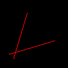

## [tinyRenderer笔记-lesson1](https://github.com/ssloy/tinyrenderer/wiki/Lesson-1:-Bresenham%E2%80%99s-Line-Drawing-Algorithm)
### 最简单的画线实现
* 简单步进, 划分100，每次步进一点点，最后画条线

* 问题：低效，依赖于步进长度，如果线很长，步进长度短会出现大裂缝(采样不足)

``` rust
void line(int x0, int y0, int x1, int y1, TGAImage &image, TGAColor color) { 
    for (float t=0.; t<1.; t+=.01) { 
        int x = x0 + (x1-x0)*t; 
        int y = y0 + (y1-y0)*t; 
        image.set(x, y, color); 
    } 
}
```
### second
* 步进长度其实很容易得到，这里用x的的步进作为实际步进长度，但是这有错误(erroneous)
* 计算当前步进比例`t`
* `y = y0 + (y1 - y0) * t`
* 问题：一条线正常，另一条有洞，没有第三条线
    * 第一条和第三条，是相同两条线，只是颜色不同，方向不同，目前处理不了

``` rust
void line(int x0, int y0, int x1, int y1, TGAImage &image, TGAColor color) { 
    for (int x=x0; x<=x1; x++) { 
        float t = (x-x0)/(float)(x1-x0); 
        int y = y0*(1.-t) + y1*t; 
        image.set(x, y, color); 
    } 
}

line(13, 20, 80, 40, image, white); 
line(20, 13, 40, 80, image, red); 
line(80, 40, 13, 20, image, red);
```

### third
* 上面红线有洞是因为，纵向y比横向x大，导致采样不足，需要哪个大用哪个作为步进长度，这里的操作是如果steep，交换x和y，
* 然后保证前后两点前面的x比后面的小，就是大了就交换一下
* 问题：到这里为止已经基本能保证画线的需求，但是效率不高

``` rust
void line(int x0, int y0, int x1, int y1, TGAImage &image, TGAColor color) { 
    bool steep = false; 
    if (std::abs(x0-x1)<std::abs(y0-y1)) { // if the line is steep, we transpose the image 
        std::swap(x0, y0); 
        std::swap(x1, y1); 
        steep = true; 
    } 
    if (x0>x1) { // make it left−to−right 
        std::swap(x0, x1); 
        std::swap(y0, y1); 
    } 
    for (int x=x0; x<=x1; x++) { 
        float t = (x-x0)/(float)(x1-x0); 
        int y = y0*(1.-t) + y1*t; 
        if (steep) { 
            image.set(y, x, color); // if transposed, de−transpose 
        } else { 
            image.set(x, y, color); 
        } 
    } 
}
```
## Timings: fourth attempt
* 由于使用bevy实现上面的图像，导致这里的benchmark没法做
* 只做了阅读理解
    * 目前代码有太多的`除法`
    * 没有做assets和check on going beyond the borders，就是需要`错误处理`和`边界判断`
    * 优化很危险，应该清楚理解代码会运行的平台。是在优化`graphics card`或者`just for CPU`，这两者完全不同。
    * 代码需要`profiled`
    * 经过测试，`10%在copy color`，`70%在调用上面的画线程序`，这里就是需要优化的部分

## Fourth attempt continued
* 每一次除法，都有相同的除数`(x1 - x0)`，拿到外边
* 设立一个error variable，告诉我the distance to the best straight line from out current (x,y) pixel,we increase (or decrease) y by one, and decrease the error by one as well。
    * 个人理解，首先for循环是`步进dx的长度`，所以derror是`dy / dx`，也就是对于每次`前进一次x，应该前进多少y`,而这里`y是int`形，所有`只有在error > .5`的时候，`y需要增加步进长度`，这里`为啥就不太清楚了`，有点像是四舍五入，或者是某种数值计算优化，然后`error会自己减掉一次步进长度`因为这个`步进长度已经被y使用了`
* 由于没有`除法`，`line`的效率和`set Image` 的效率差不多了
``` rust
void line(int x0, int y0, int x1, int y1, TGAImage &image, TGAColor color) { 
    bool steep = false; 
    if (std::abs(x0-x1)<std::abs(y0-y1)) { 
        std::swap(x0, y0); 
        std::swap(x1, y1); 
        steep = true; 
    } 
    if (x0>x1) { 
        std::swap(x0, x1); 
        std::swap(y0, y1); 
    } 
    int dx = x1-x0; 
    int dy = y1-y0; 
    float derror = std::abs(dy/float(dx)); 
    float error = 0; 
    int y = y0; 
    for (int x=x0; x<=x1; x++) { 
        if (steep) { 
            image.set(y, x, color); 
        } else { 
            image.set(x, y, color); 
        } 
        error += derror; 
        if (error>.5) { 
            y += (y1>y0?1:-1); 
            error -= 1.; 
        } 
    } 
} 
```

## Timings: fifth and final attempt
* 这里`消除float的使用`，添加了一个`derror2`，然后思路和上面其实差不多，就是`整体*2dx`
* 这样之后`set_image`操作的时长已经超过了`line`操作
``` rust
void line(int x0, int y0, int x1, int y1, TGAImage &image, TGAColor color) { 
    bool steep = false; 
    if (std::abs(x0-x1)<std::abs(y0-y1)) { 
        std::swap(x0, y0); 
        std::swap(x1, y1); 
        steep = true; 
    } 
    if (x0>x1) { 
        std::swap(x0, x1); 
        std::swap(y0, y1); 
    } 
    int dx = x1-x0; 
    int dy = y1-y0; 
    int derror2 = std::abs(dy)*2; 
    int error2 = 0; 
    int y = y0; 
    for (int x=x0; x<=x1; x++) { 
        if (steep) { 
            image.set(y, x, color); 
        } else { 
            image.set(x, y, color); 
        } 
        error2 += derror2; 
        if (error2 > dx) { 
            y += (y1>y0?1:-1); 
            error2 -= dx*2; 
        } 
    } 
} 
```
* [一些额外的优化](https://github.com/ssloy/tinyrenderer/issues/28)
    * 比如其中将`对于steep的判断，移到了for的外面`，进一步降低了时间
    * 并提到将`y1>y0? 1:-1也转移到for外面`，也能降低时间
    * 又提到现在的`编译器会做相关的优化`，因而这几步操作：`虽然值得有相关的意识，但现在已经没有那么必要`，毕竟会降低代码的可读性和复用性

## Wireframe rendering
* 这里需要下载他提供的`obj文件`
* 用bevy直接读入，并`parse v和f`，`f`是取所有的三大块里的第一小块重新组合，得注意读题...
* 然后用line画出来
* 使用`bevy`遇到的`问题`:
    * bevy的image的`起点在左上角，这里在左下角`，画图的时候需要特殊处理
    * `obj文件`里会`同时出现0点和800点`，也就是当我`设置图片大小是800`的时候，obj文件里的`800会out of index`，需要特殊处理
