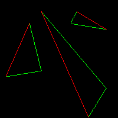
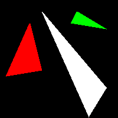

## [tinyRenderer笔记-lesson2](https://github.com/ssloy/tinyrenderer/wiki/Lesson-2:-Triangle-rasterization-and-back-face-culling)

## old-school method: Line sweeping 线扫，就是一行一行画线完成一个三角形绘制
* 先使用上一次的`line`绘制三角形的`contour`
* 绘制一个三角的`好方法`需要包含以下特征
    * simple and fust，`简单快速`
    * symmetrical: the picture should not depend on the order of vertices passed to the drawing function。`允许输入的三个point乱序`
    * two triangles have two common vertices, there should be no holes between them because of rasterization rounding，ai说是`两个三角形有共同的顶点`(common vertices),不应该因为光栅化的四舍五入操作(rasterization rounding)，导致顶点之间出现了空隙(hols)`TODO:说不上理解`
* `传统的line sweeping，线扫描过程:`
    1. 根据y-coordinates对三个point进行排序
    2. 同时(simultaneously)对三角形的左侧和右侧，进行栅格化Rasterize
    3. 在左右边界点(boundary points)之间画一条水平线段，horizontal line segment：

* `提问：哪一个segment是左边的，哪一个是右边的`
    * 假设有`t0,t1,t2三个点`，按`y ascending 排序`，则`boundary A 是t0-t2，boundary B 是t0-t1 和t1-t2`
    * 
    * 这里边界`boundary A 是红色的`，`boundary B 是绿色的`
    * 目前`boundary B 是两个部分`，现在要画bottom half of the triangle by cutting it horizontally，水平切一刀，切成两半，就是切两个绿线连接的那个点，`将三角形分成上下两半分别绘制`
    * 首先画了`下三角形`，但是并没有做之前line的那些操作，为了让线段连续，交换xy啥的。因为之后要做三角形的填充，而填充后就看不见线了，无所谓连续
    * 然后就是上下分别填充的代码，放到一起，得到三个填充颜色后的彩色三角形
    * 

## 方法2 the method i adopt for my code

* 线扫line sweeping是针对早期单线程的cpu programming: 看一个新的pseudo-code伪代码
``` rust
triangle(vec2 points[3]) { 
    vec2 bbox[2] = find_bounding_box(points); 
    for (each pixel in the bounding box) { 
        if (inside(points, pixel)) { 
            put_pixel(pixel); 
        } 
    } 
}
```
* 输入3个点，先找出一个`包围盒（在101有讲，就是一个能包住这三个点的最小正方形）`针对每一个在bounding box里的pixel，判断pixel是否在三个点组成的三角形内，如果在，put_pixel，近似于101里讲的采样方法
    * 离题：判断pixel是否在四边形内比较麻烦，这里不处理

* 定义重心坐标
    * 101那边的定义更好理解：给定一个三角形ABC，这个三角形坐在的2维平面的任意一点都可以表示成三个顶点坐标的线性组合linear combs,只要线性组合的系数和=1
    * 三角形内的任意点P，表示成：\\(P=(1-u-v)A + uB + vC\\)
    * 文中另一个描述是：只要我们想象，放了3个重量1-u-v,u,v到点ABC上，那么三个点的重心，就在点P上。
    * `TODO:不懂`也可以说点P has coordinates(u,v)，in the (oblique) basis \\((A, u\vec{AB}, u\vec{AC})\\)，这里看到的就是，式子展开，可以把点A-点B看成向量AB，得到下面个式子比较自然，但是coordinates(u,v) in basis的说法没有理解
    * \\(P = A + u\vec{AB} +v\vec{AC}\\)
    * 所以进一步简化，就是找\\( u\vec{AB} + v\vec{AC} + \vec{PA} = \vec{0}\\)
    * 可以拆分成x方向和y方向的而两个equations
    * \\[$$
\begin{equation*}
\begin{cases}
u\overrightarrow{AB_{x}} & +\ u\overrightarrow{AC_{x}} +\ \overrightarrow{PA_{x}} \ =\ 0\\\\
u\overrightarrow{AB_{y}} & +\ u\overrightarrow{AC_{y}} +\ \overrightarrow{PAy} \ =\ 0
\end{cases}
\end{equation*}
$$\\]
    * 写成矩阵形式:
    * \\[$$
\begin{equation*}
\begin{cases}
\begin{bmatrix}
u & v & 1
\end{bmatrix} & \begin{bmatrix}
\overrightarrow{AB_{x}}\\
\overrightarrow{AC_{x}}\\
\overrightarrow{PA_{x}}
\end{bmatrix} \ =\ 0\\
\begin{bmatrix}
u & v & 1
\end{bmatrix} & \begin{bmatrix}
\overrightarrow{AB_{y}}\\
\overrightarrow{AC_{y}}\\
\overrightarrow{PA_{y}}
\end{bmatrix} \ =\ 0
\end{cases}
\end{equation*}
    $$\\]
    * 所以要找的是一个(u, v, 1)向量，同时垂直于ABx,ACx,PAx和ABy,ACy,PAy这两个向量，就是原本两点形成向量，现在三个向量的分量形成了新的向量，容易迷糊=_=，所以只需要求个cross，叉积，就能得到uv1这个向量
    * 所以现在在那个包围盒bounding box里的所有pixel都求一个重心坐标，如果其中有一个点是负值，说明这个点在三角形外，则不画出来
    *实际代码操作，求出包围盒左下角右上角，通过遍历所有pixel，然后做一个clamp，确定不会超出屏幕，然后做画三角操作

## flat shading render
* 首先尝试用随机颜色填充了三角形：这之后提供的代码没有使用那个`方法2`画线，那个应该对`点的顺序有要求`，没有提，`TODO:暂时没能成功用方法2画出彩色填充model`
* `现在添加光`
  * the polygon is illuminated most brightly when it is orthogonal to the light direction垂直照射，多边形最亮
  * 如果平行，那将一点光没有。
  * 总结，the intensity of illumination is equal to the scalar product of the light vector and the normal to the giben triangle.the normal to the triangle can be calculated simply as the cross product of its two sides，叉积乘出三角形的垂直向量，然后与光入射向量做点积得出入射角度
  * 这个课程perform linear computations on the colors，认为color线性增长，但其实128的color并非half as bright as 255， 忽略了其中的误差
  * dot product可以为负值negative。这说明光的入射角度在polygon的下方，我们可以直接丢弃相关的三角，可以允许我们快速的删除一些看不见的三角，这叫做`[Back-face culling](http://en.wikipedia.org/wiki/Back-face_culling)`
  * 
  * 注意嘴唇那里有inner cavity of the mouth is drawn on top of the lips.由于dirty clipping of invisible triangles：这种clipping只对convex shapes，凸起的形状 only。将get rid of 摆脱 这种artifact人工造物，当使用z-buffer的时候

