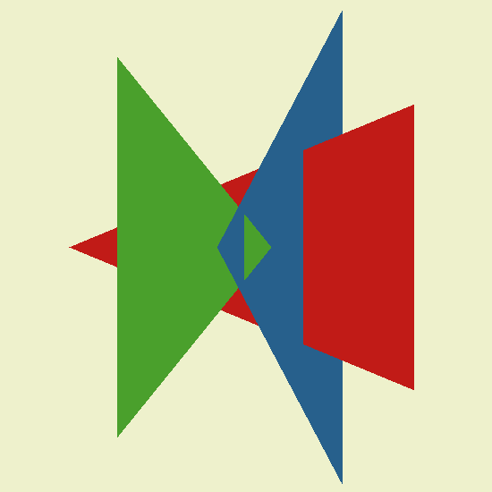

## [tinyRenderer笔记-lesson3](https://github.com/ssloy/tinyrenderer/wiki/Lesson-3:-Hidden-faces-removal-(z-buffer))

## z-buffer introduction
* get rid of 摆脱 the visual artifacts 手工艺品 of the hidden faces removal we had
* 如果从后边往前画三角，可以不丢失任何一个三角，后面会覆盖前面的，就像画油画
* 画家算法理论上可以通过从后向前逐层绘制三角面来避免面消隐,但它有几个重大问题:
1. 计算成本高。每次相机视角变化都需要重新排序整个场景,这在复杂场景下代价很大。
2. 无法处理动态场景。如果场景对象在运动,绘制顺序也在变化,画家算法无法高效地处理这种情况。
3. 无法确定正确顺序。有时候很难确定三角面正确的绘制顺序,从而导致面消隐现象。

## Let us try to render a simple scene
* 假设从上往下看三个穿插的三角形
* 三维情况如下
    * 
* 从上方看的渲染结果如下
    * 
* blue部分在red前面，三个都有穿插，先画哪个都不对
1. 画家算法无法在这个例子中工作,需要通过细致的空间分割来判断triangle之间的相对位置。
2. BSP树可以实现这种空间分割,但代价太高,难以在实时渲染中使用。
3. 理想的解决方案应更加高效,避免过度依赖细致的空间分割。Z缓冲算过为每个像素记录最近的面实现了这一点,这也是它相比BSP树更加实用的原因。

## Even simpler: let us lose a dimension. Y-buffer
* 用黄色切割上面的立体图，直接干成二维的，只看切割的这条线
    * 
    * 
* our scene 是二维，所以用line()简单画了一下
* 实际显示的是从sideway，侧面看到的三角形和黄色平面的交线
* 开始render。render是1pixel height。代码里实际上是16pixels,为了在高分辨率的屏幕下也能看清楚。
* rasterize() writes only in the first line of the image render。
* 这里定义了一个magic array `ybuffer` with dimensions(width, 1)，用minus infinity 初始化。
* 然后调用rasterize() 渲染，
* 很简单：遍历所有的x-coordinates，在p0.x和p1.x之间，计算，corresponding(相应) y-coordinate of the segment。然后检查我们在ybuffer里根据当前的xindex得到了什么。如果y-value 离camera的距离更近，则y-value更新为ybuffer，然后draw it on the screen and update the ybuffer。
* 下面提供了一下过程，step-by-step，在第一次调用rasterize() on the first (red) segment this is our memory
* 红色从左到右，表示距离由远到近，然后覆盖绿色，因为绿色更近，因而覆盖，然后蓝色，由于蓝色部分更近，因而无法完全覆盖

## 回到3d
* 回到2d，z-buffer是二维的，记录每一个x,y的z深度
* 最复杂的部分是计算z-value of a pixel
* 看回y的那部分代码，其实在算的是barycentric坐标 * 所以every pixel，we want to draw simply to multiply its barycentric coordinates by the z-values of the vertices of the triangle we rasterize，就是每个坐标，都用z值乘重心坐标

## 后面留了贴纹理的作业，但不晓得咋读tga，放弃了
* 参考下下一节课的代码